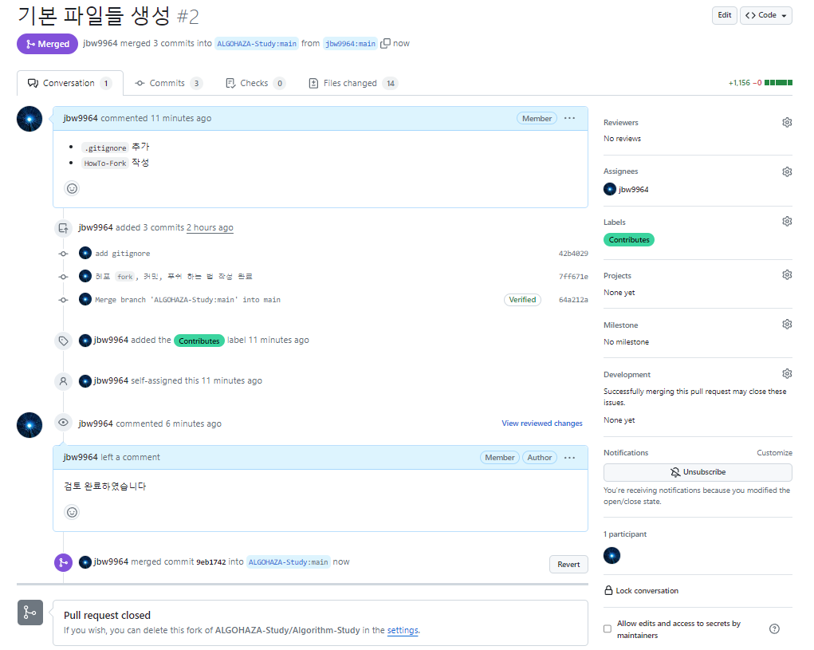

### 본 문서에서는 `Fork` 한 `Repo` 를 통해 상위 `Repo` 에 기여하는 법을 서술합니다.

---

### 1. 상위 `Repo` 와 `Fork-Repo` 동기화하기

여러분들이 `Fork-Repo` 에 개발한 내용을 상위 `Repo` 로 올리기 전, 동기화가 필요합니다. 이를 지키지 않을 시 `git 충돌` 이 일어날 수 있습니다.

<!-- contribute_1.png -->

    

여러분의 `Fork-Repo` 상단을 보면 `Contribute`, `Sync fork` 버튼이 있습니다. `Contribute` 는 `Pull Request` 를 만드는 버튼이고 `Sync fork` 는 상위 `Repo` 와 동기화 하는 버튼입니다.

<!-- contribute_2.png -->

    

`Sync fork` 를 누르면 동기화를 진행할 것인지 묻는 버튼이 나옵니다. 이 때 `Discard commits` 버튼을 누르면 `Fork-Repo` 의 개발 내용이 모두 사라질 수 있으므로 각별히 주의하시길 바랍니다.

<!-- contribute_3.png -->

    

`Update branch` 버튼을 누르면 자연스레 동기화가 진행됩니다.

---

### 2. 상위 `Repo` 에 `Pull Request` 만들기

<!-- contribute_4.png -->

    

`Contribute` 의 `Open Pull Request` 버튼을 누릅니다.

<!-- contribute_5.png -->

    

버튼을 누르면 `PR` 에 포함될 커밋들을 볼 수 있습니다. 여기서 우측 `Create Pull Request` 버튼을 누르면, `Fork-Repo` 의 개발 내역을 상위 `Repo` 에 넣어주는 `PR` 을 생성할 수 있습니다.

<!-- contribute_6.png -->

    

버튼을 누르면 해당 `PR` 이 무엇에 관한 내용인지 서술하는 내용이 나옵니다. 

<!-- contribute_7.png -->

    

기본 양식에 맞춰 작성 후, `Create Pull Request` 버튼을 누르면 완료됩니다.

---

### 3. `PR` 제출 이후

`PR` 은 말 그대로 요청하는 것이기 때문에, 상위 `Repo` 에 곧바로 적용되지 않습니다.

<!-- contribute_8.png -->

    

위 그림은 상위 `Repo` 에 설정한 규칙으로 `"PR 이 수락되지 않은 상태"` 입니다. `PR` 이 수락되려면 적어도 관리자 1 명의 승인을 받아야 합니다.

<!-- contribute_9.png -->

    

`PR` 제출 시 관리자가 변경점, 누락된 부분 등을 감안해 추가적인 내용을 요구할 수 있습니다. 관리자의 승인 후, 관리자의 `merge` 를 통해 여러분의 개발 내역이 상위 `Repo` 에 적용되게 됩니다.

---
