### 본 문서에서는 상위 `Repository` 를 `Fork` 하는 법을 서술합니다.

---

### 1. 상위 `Repo` 에서 `Fork` 를 눌러 새로운 저장소 만들기

<!-- fork_repo_1.png -->

<p align="center">
    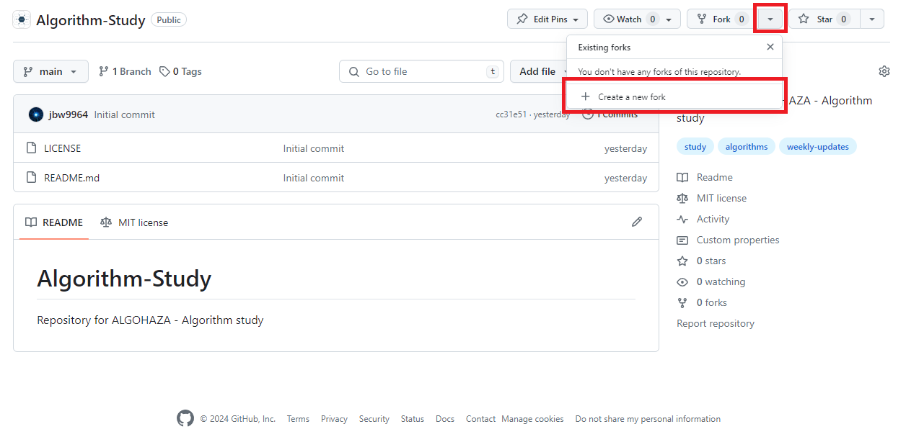
</p>

위 그림처럼 상위 `Repo` 페이지의 우상단에는 `Fork` 버튼이 있습니다. 버튼을 눌르고 `Create a new fork` 을 누르면 상위 `Repo` 와 연동 가능한 자신의 `Repo` 를 만들 수 있습니다.


<!-- fork_repo_2.png -->

<p align="center">
    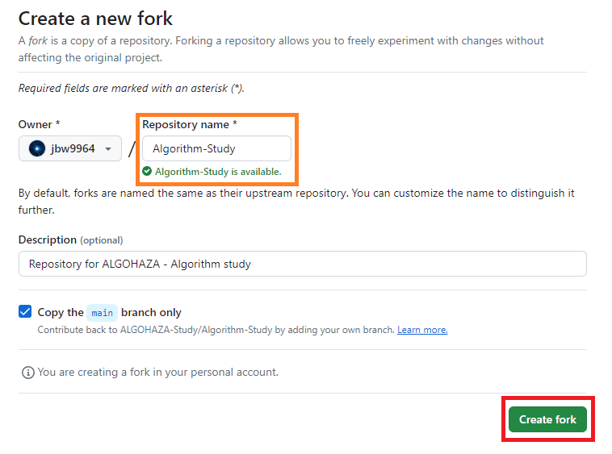
</p>

`Create a new fork` 버튼을 누르면 위 그림처럼 자신이 소유한 `Repo` 를 어떻게 만들지 보이게 됩니다. `Repo` 의 이름은 자신이 원하는 대로 설정할 수 있습니다.

설정을 완료한 후, 우하단의 `Create Fork` 를 눌러 `Repo` 를 만들 수 있습니다.

<!-- fork_repo_3.png -->

<p align="center">
    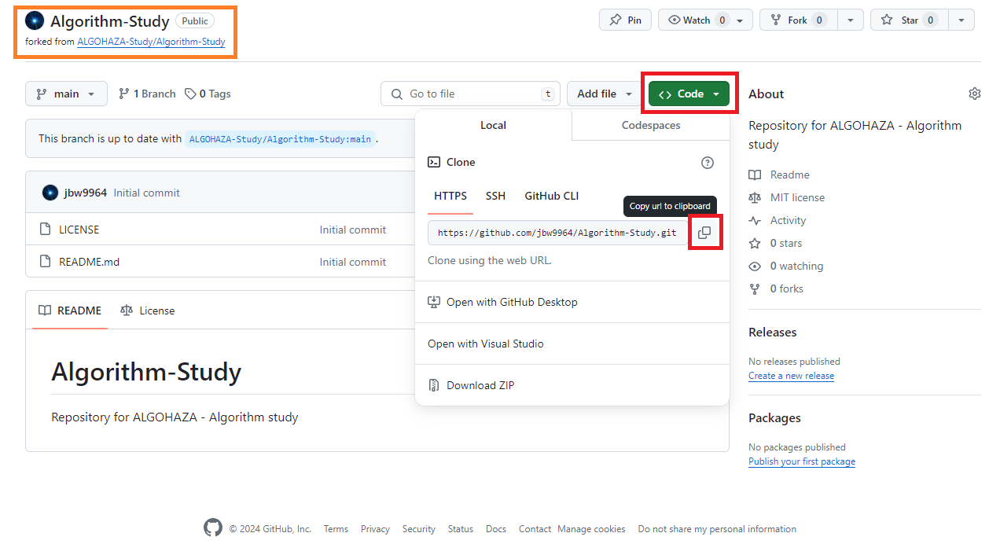
</p>

위 그림에서 볼 수 있듯이 자신이 소유한 `Repo` 가 완성되었습니다. 우상단 박스를 보면 `forked from ALGOHAZA-Study/Algorithm-Study` 라는 설명이 붙어있음을 볼 수 있습니다. 

---

### 2. `Fork` 한 `Repo` 컴퓨터에 옮기기

원활한 개발을 진행하려면 `Repo` 를 컴퓨터 `(로컬)` 에 옮겨두는 게 편합니다.

<!-- fork_repo_3.png -->

<p align="center">
    
</p>

앞서 `Fork` 한 `Repo` 의 우상단을 보면 `<> Code` 버튼이 있습니다. 이를 누르면 현 `Repo` 의 `git` 주소를 복사할 수 있습니다.

이 주소를 통해 컴퓨터로 `Repo` 를 복사할 수 있습니다.

**<ins>❗❗❗ 컴퓨터로 `Repo` 를 복사하기 위해선 컴퓨터에 `git` 이 설치되 있어야 합니다. ❗❗❗</ins>**

`윈도우 git 설치 방법`, 또는 `mac git 설치 방법` 으로 검색하시면 많은 예시가 있으니 `git` 을 설치하시길 바랍니다.

<!-- fork_repo_4.png -->

<p align="center">
    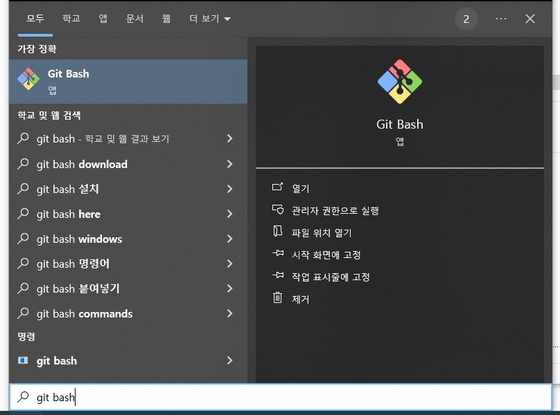
</p>

다양한 방법이 있으나 현 문서에서는 `Git Bash` 를 이용하겠습니다. 위 그림처럼 `Git Bash` 프로그램을 찾은 후 실행합니다.


<!-- fork_repo_5.png -->

<p align="center">
    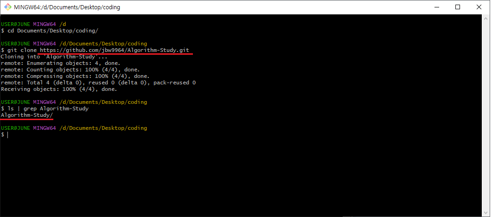
</p>

`Git Bash` 를 열면 컴퓨터의 `home` 디렉토리에 연결되고, `cd` 명령어를 통해 현 디렉토리를 변경할 수 있습니다.

`cd` 명령어를 통해 원하는 곳으로 디렉토리를 변경하고, `git clone` 명령어로 `Repo` 를 복사합니다.

```bash
$ cd {원하는 디렉토리}
$ git clone {git 주소}
```

이 때 앞서 복사한 `git 주소` 를 **제대로** 입력해야 합니다.

`Repo` 를 제대로 복사하였다면 하위 디렉토리에 `Repo 이름` 과 같은 폴더가 생성됩니다. 해당 폴더가 여러분의 `Repo` 를 컴퓨터로 옮긴 폴더입니다.

```bash
$ ls                        # 현 디렉토리에 존재하는 폴더들 보여주기
$ ls | grep {Repo 이름}     # {Repo 이름} 인 폴더만 보여주기
```

---

### 3. 추후 개발 방법

아래 예시는 `VScode` 를 이용하였습니다.

앞서 컴퓨터에 생성한 `Repo` 를 선택해 폴더를 엽니다.

<!-- fork_repo_6.png -->

<p align="center">
    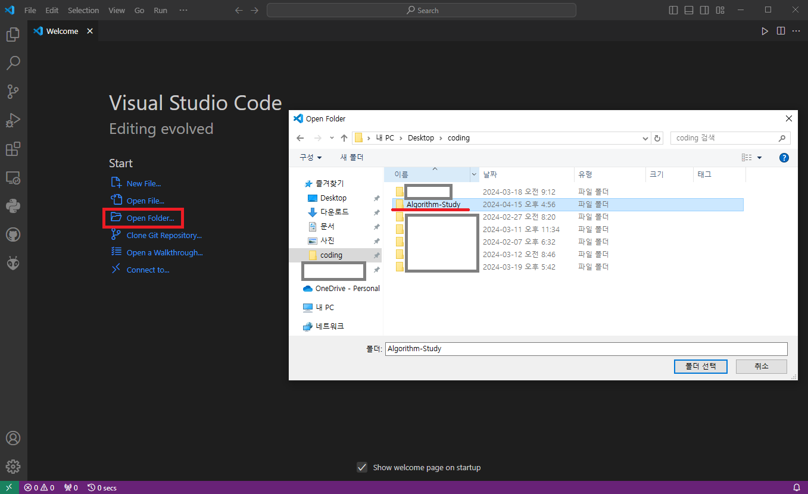
</p>

이 때 생성한 `Repo` 가 보이지 않는다면 선택한 디렉토리가 올바른지 확인해 주시길 바랍니다.


<!-- fork_repo_7.png -->

<p align="center">
    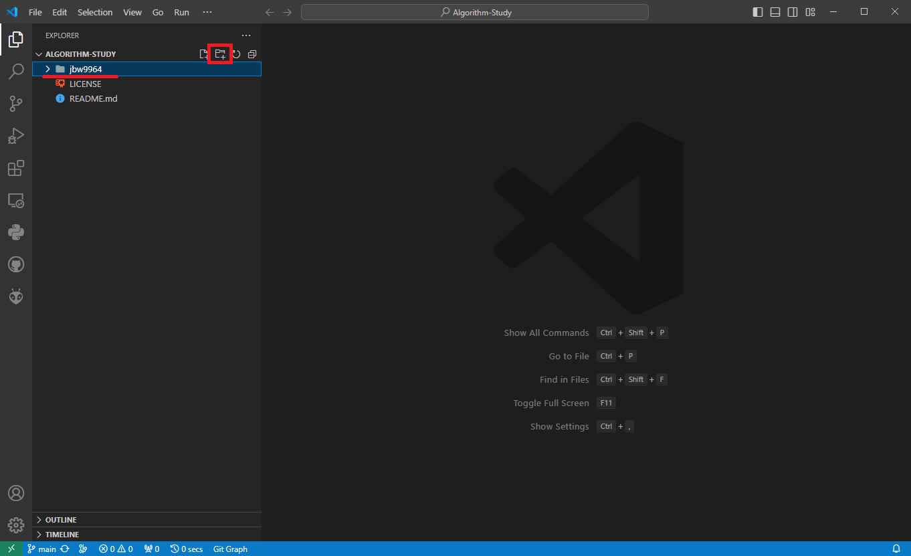
</p>

`VScode` 로 폴더를 연 후, **<ins>❗❗ 자신의 github 이름으로 된 폴더를 생성해 주십시오. ❗❗</ins>**

**<ins>앞으로의 개발은 모두 각자 자기 github 이름으로 된 폴더에서만 이루어집니다.</ins>**

어느 개발을 완료한 후, `commit` 과 `push` 를 진행해야 `Repo` 에 개발 상황을 기록할 수 있습니다.
`commit` 은 **오직** 로컬 컴퓨터에만 상황이 기록되는 것이고, `push` 는 저장한 `commit` 들을 원격 `Repo` `(github 사이트에서 볼 수 있는 Repo)` 로 보내 기록하는 행위입니다.

#### A. `local` 에 `commit` 하기

개발이 완료된 후, `Git Bash` 또는 `VScode` 기능을 이용해 `commit` 을 진행할 수 있습니다.

<!-- fork_repo_8.png -->

<p align="center">
    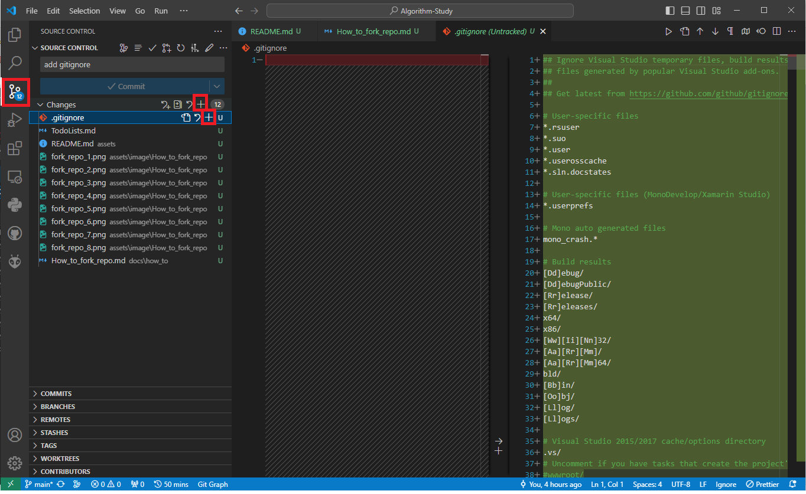
</p>

`VScode` 왼쪽 바를 보면 `Source Control` 버튼이 존재합니다. 버튼을 누루면 `commit` 하기 전 `Repo` 와 현 `Repo` 의 차이를 보여줍니다.

`Source Control` 에서는 `+` 버튼을 통해 `commit` 할 파일을 선택할 수 있습니다. `Changes` 바 오른쪽 `+` 을 눌러 모든 파일을 선택할 수 있고, 파일 개별적으로 `+` 눌러 선택할 수 있습니다.

예를 들어 그림에서는 `.gitignore` 파일을 선택하였습니다. `VScode` 창 내 왼쪽 영역은 `이전 .gitignore` 파일, 오른쪽은 `현재 .gitignore` 파일을 보여줍니다.

만약 이전 파일에서 무언가가 삭제되었으면 빨간색으로, 추가되었으면 녹색으로 표시됩니다.

<!-- fork_repo_9.png -->

<p align="center">
    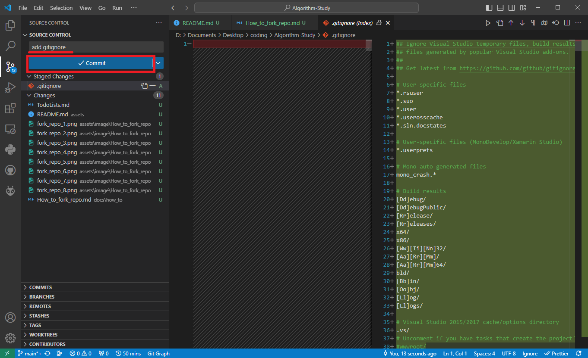
</p>

`commit` 할 파일을 선택한 후, `commit message` 를 작성해야 합니다. `commit message` 는 주로 개발한 내용, 개선 내용 등이 포함되어 있습니다.

`commit message` 작성 후 `Commit` 버튼을 누르면 컴퓨터 `Repo` 에 변경사항을 저장하게 됩니다.

<!-- fork_repo_10.png -->

<p align="center">
    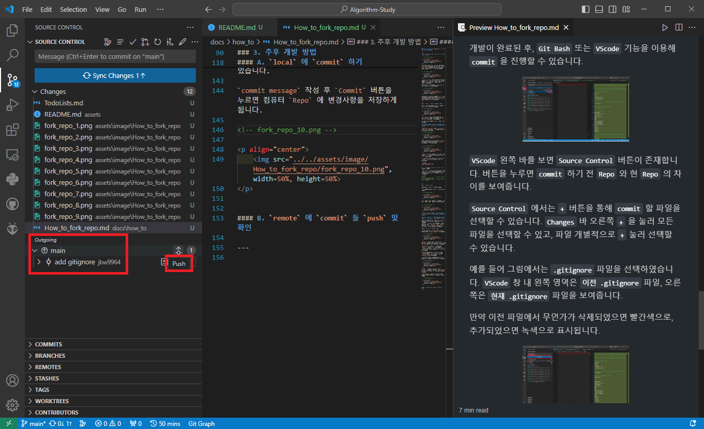
</p>

올바르게 `commit` 을 진행한 경우, 위 그림처럼 `Outgoing` 부분이 생겨 원격 `Repo` 에 `push` 할 `commmit` 들을 보여줍니다.


#### B. `remote` 에 `commit` 들 `push` 및 확인

<!-- fork_repo_10.png -->

<p align="center">
    
</p>

`Outgoing` 부분 옆 화살표에 커서를 올리면 `Push` 버튼이 나타납니다. 이를 눌러 원격 `Repo` 에 `commit` 들을 기록시킬 수 있습니다.

<!-- fork_repo_11.png -->

<p align="center">
    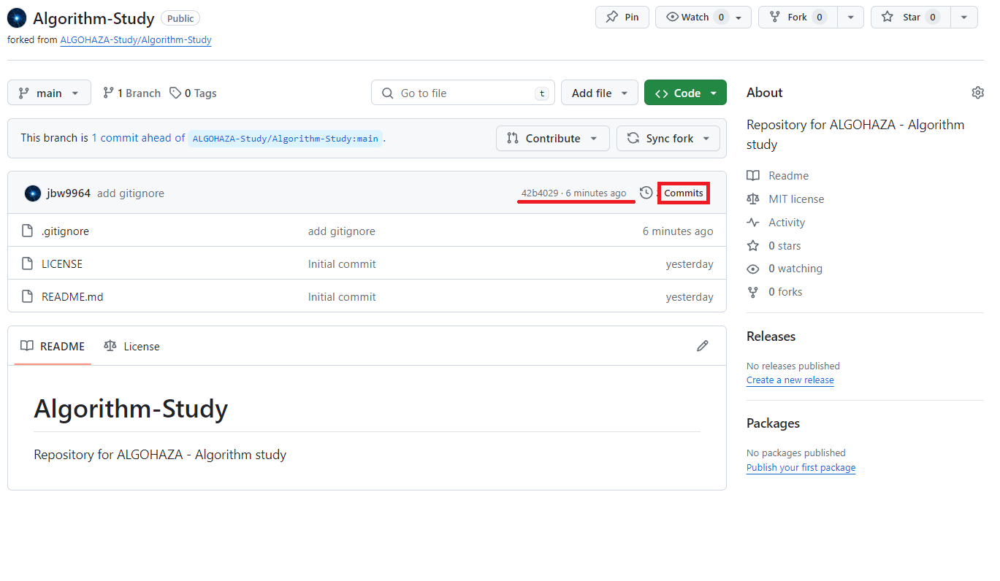
</p>

`push` 를 진행한 후, `Github` 에 접속하여 제대로 `push` 되었는지 확인할 수 있습니다.

그림을 보면 `42b4029` 커밋이 6 분 전에 제출되었다고 적힌 것을 볼 수 있습니다. 또한 옆의 `Commits` 를 눌러 해당 원격 `Repo` 의 모든 커밋 기록을 확인할 수 있습니다.

<!-- fork_repo_12.png -->

<p align="center">
    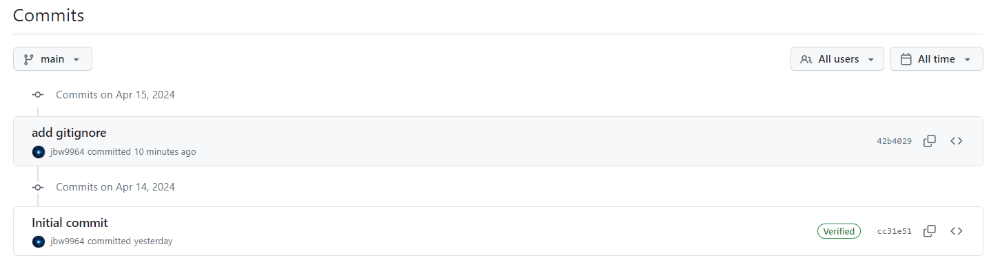
</p>

---
