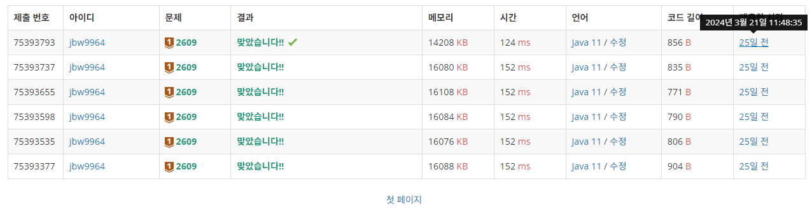

---

## 📁 문서 정리 구조

문서 구조는 크게 `M_{활동연도}_{월}`, `{주차수}`, `{풀이 문제}` 로 나뉩니다.

```
jbw9964/                    # 멤버 별 활동 폴더
├── M_2024_03
└── M_2024_04                   # 활동 연도/월
    ├── Week_2
    └── Week_3                  # 활동 주차 수
        ├── P_2609              # 풀이 문제
        │   ├── README.md               # 문제 설명 + 풀이 정리
        │   ├── Solution_2609.java      # 정답 소스코드
        │   └── approval_2609.PNG       # 인증 스크린샷
        └── P_10950
            ├── README.md
            ├── Solution_10950.java
            └── approval_10950.PNG

6 directories, 6 files
```

각 멤버별 활동 폴더 `(jbw9964)` 내 위 구조처럼 조직합니다.

- `M_{활동연도}_{월}` 폴더는 해당 `연도/월` 에 활동한 내역을 저장합니다.
- `{주차수}` 폴더는 활동한 주차별로 제작합니다.
- `{풀이 문제}` 폴더는 `풀이한 문제` 를 기록하는 폴더입니다.

만약 `{풀이 문제}` 폴더가 위 양식에 맞지 않는 경우, 멤버가 직관적으로 알아볼 수 있게 양식을 변경합니다.

---

## 📑 작성 예시

- `README.md` : 문제 설명 + 풀이 정리

    자신이 해당 문제를 어떻게 이해했는지, 그리고 어떻게 해결하려 하였는지 등이 포함되어 있으면 좋습니다.
    
    또한 남들과 자신의 소스코드를 비교해 풀이법의 개선점, 미처 생각지 못한 풀이방법 등을 적으면 좋습니다.

    <details><summary> 예시 펼치기</summary>

    ```markdown
    ---

    ## 🔖 문제 설명

    - 주어진 두 수의 최대 공약수와 최소 공배수를 구하는 문제이다.
    - `link` : [`click`](https://www.acmicpc.net/problem/2609)

    ---

    ## 🍳 스스로 생각한 접근 방식

    문제를 보니 유클리드 호제법을 이용하면 좋겠다는 생각이 들었다.

    > 💡 유클리드 호제법이란?
        최대 공약수를 구하는 대표적인 알고리즘으로, **“두 수 a, b (a > b) 가 있을 때, 이 둘 간의 서로소 r 은 b 와 (a % b) 의 서로소와 같다”** 는 법칙이다.
        자세한 내용은 [`[1]`](#1--euclidean-algorithm---wikepedia) 을 참고하는 것이 좋을 듯 하다.

    호제법을 이용하면 아주 간편히 최대 공약수를 알아낼 수 있다. 그런데 생각해보니 최대 공약수를 이용하면 최대 공배수 또한 알 수 있었다.

    두 수 $A, B$ 의 최대 공약수를 $r$ 이라 하면, $A = a \times r, \ \ B = b \times r$ 로 나타낼 수 있다. 

    이 때 두 수의 최대 공배수는 $a \times b \times r = A \times B \div r$ 로 나타낼 수 있다.

    결국 유클리드 호제법만 잘 구현하면 끝나는 문제인 것이다.

    ---


    ## ❗ 틀린 이유 설명

    `(올바르게 문제를 풀이했다)`

    ---


    ## ✅ 올바른 접근 방식 및 해결 방식

    `(올바르게 문제를 풀이했다)`

    ---

    ## 🛠 자신의 풀이에서 개선할 부분

    유클리드 호제법의 시간 복잡도를 생각해 보았다. 

    직관적으로 생각했을 때, $O(\mathbf{log}(N))$ 과 유사할 것이라 생각하였다. 애초에 유클리드 호제법은 두 수의 `modulo` 연산으로 이뤄지기 때문이다.

    찾아본 결과 [`[2]`](#2--euclidean-algorithm---codility) 와 같은 글을 볼 수 있었고, 이에 따르면 호제법은 $O(\mathbf{log(max}(a, b)))$ 의 시간 복잡도를 가진다 한다.

    ---

    ## Reference

    - ##### [`[1] : Euclidean algorithm - Wikepedia`](https://en.wikipedia.org/wiki/Euclidean_algorithm)
    - ##### [`[2] : Euclidean algorithm - Codility`](https://codility.com/media/train/10-Gcd.pdf)

    ---
    ```

    </details>


- `Solution` : 정답 소스코드

    이후 자신의 코드를 보았을 때, 이해하기 좋은 형태로 만들면 좋습니다.

    또한 남들이 이해하기 편하도록 주석 등을 달아놓는 것도 좋습니다.

    <details><summary> 펼치기</summary>

    ```java
    import java.io.BufferedReader;
    import java.io.IOException;
    import java.io.InputStreamReader;
    import java.util.StringTokenizer;

    public class Solution_2609 {

        private static final BufferedReader br = new BufferedReader(
            new InputStreamReader(System.in)
        );


        public static void main(String[] args) throws IOException {
            StringTokenizer tokenizer = new StringTokenizer(br.readLine());
            
            int num1 = Integer.parseInt(tokenizer.nextToken());
            int num2 = Integer.parseInt(tokenizer.nextToken());

            int gcd = GCD(num1, num2);
            int lcm = num1 * num2 / gcd;

            System.out.println(gcd);
            System.out.println(lcm);
        }

        public static int GCD(int a, int b) {       // get Greatest common divisor using euclidean algorithm
            while (b != 0) {
                int mod = a % b;
                a = b;
                b = mod;
            }
            
            return a;
        }
    }
    ```

    </details>

- `approval` : 문제 풀이 인증 스크린샷

    필수는 아니지만 문제 풀이한 시간이 나오면 좋습니다.

    <!-- approval_2609.PNG -->

    <p align="center">
        
    </p>

위 예시들은 [`/assets/example/`](../../../assets/example/) 에서 확인하실 수 있습니다.

---

## 🔖 `Commits`

`Commit 메시지` 는 개발 내용을 빠르게 파악할 수 있는 좋은 수단입니다. 때문에 `Commit 메시지` 는 되도록 간결히, 핵심적인 부분만 정리해 작성하는 경우가 많습니다.

`Commit 메시지` 규칙이 존재하진 않으나, `PR` 검토 시 무분별한 `Commit` 내역이 존재하면 `PR` 이 회고될 수 있습니다.

때문에 무분별하게 `Commit` 하지 마시고, 개발 단위마다 묶어서 간결히 `Commit` 하는 것을 추천드립니다.

`(예 : 문제 2609 번 README.md 작성중 | 문제 2609 번 전체 작성 완료 등)`

작성 예시 : 

```
변경 내용       # 제목

변경 내용 사항      # 메시지 body

- 변경 내용이 적용된 파일 1
- 변경 내용이 적용된 파일 2
```
```
2 주차 문제 2609 번 작성 완료

2609 번에 해당하는 모든 파일 작성 완료

- Solution_2609.java
- P_2609/README.me
- approval_2609.PNG
```

---