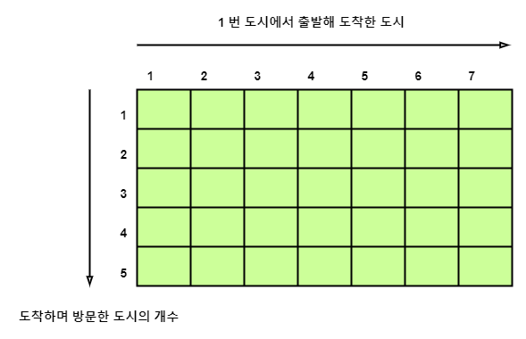
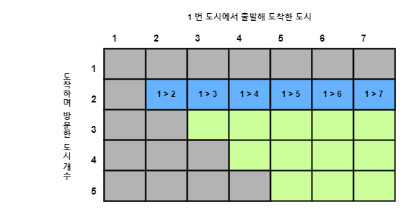
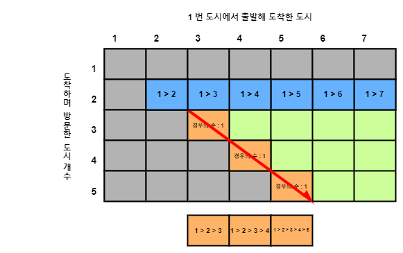
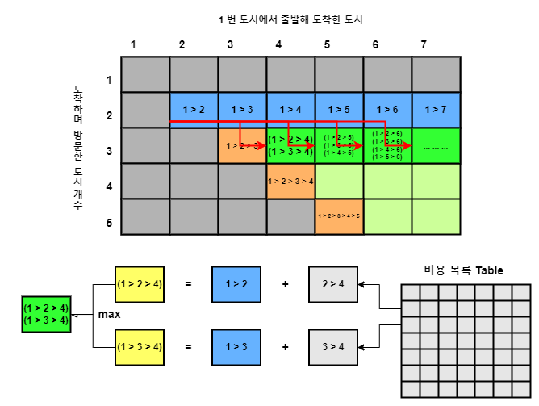
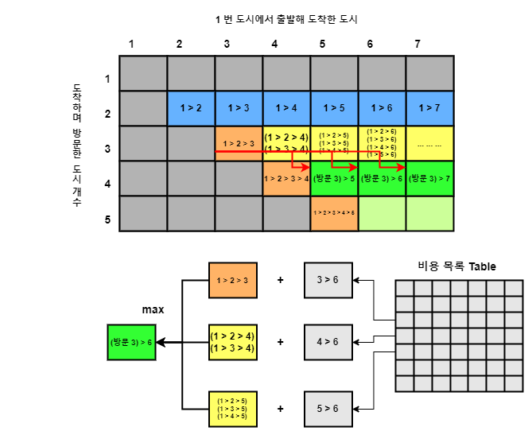
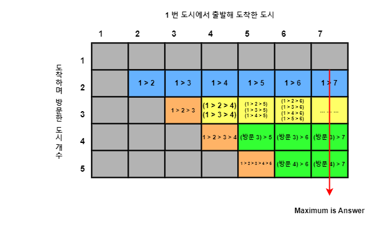

---

## [`2157 번 : 여행`](https://www.acmicpc.net/problem/2157)

- 알고리즘 분류 : `DP`, `그래프 이론`

---

## 🔖 문제 설명

- 총 `N` 개의 도시가 주어지고 각 도시에 번호가 매겨져 있다. 여행객은 `1` 번 도시에서 출발해 `N` 번 도시로 도착하려 한다. 
- 여행객은 현재 방문한 도시보다 낮은 번호의 도시에 방문하지 않는다. 또한 각 도시마다 연결된 경로가 존재하며 경로의 비용만큼 여행객은 이득을 얻는다.
- 이 때 여행객이 방문한 도시가 `M` 개를 초과하지 않으며 얻을 수 있는 최대 이득을 나타내어라.

---

## 🛑 문제 제한 조건

- 시간 제한 : $\text{2 s}$
- 도시의 개수 `N` : $1 \leq \text{N} \leq 300$
- 최대 방문할 수 있는 도시의 개수 `M` : $2 \leq \text{M} \leq \text{N}$
- 도시간 연결된 경로의 개수 `K` : $1 \leq \text{K} \leq 100,000$

---

## 🍳 스스로 생각한 접근 방식

문제를 접했을 때, `DP` 문제임을 직감하였다. 하지만 어떻게 해결할지 감이 잡히지 않아, 그냥 한번 완전탐색으로 만들어보았다.

```java
private static void compSearch(int city, int cost, int depth)   {
    if (depth > M)      return;
    if (city == N - 1)  {
        maxima = maxima < cost ? cost : maxima;
        return;
    }

    for (int i = city + 1; i < N; i++)  {
        int newCost = costTable[city][i];

        if (newCost == 0)               continue;

        compSearch(i, cost + newCost, depth + 1);
    }
}
```

---

## ❗ 틀린 이유 설명

제출해 확인하니 완전탐색 방법은 `시간초과` 되었다.

위처럼 구현한 완전탐색 방법은 깊이가 `M` 이며 자식이 `N` 개 생성되는 `Tree` 구조와 유사하다.
때문에 시간복잡도는 $O(N^{M})$ 이며 당연히 `시간초과` 된다.

문제를 해결하고자 해답을 검색하였고, 다음 [`[1]`](#1--백준-2157번-여행---qwerty1434s-velog), [`[2]`](#2--백준-2157번-여행---mmaprogramers-velog) 를 참고하였다.


---

## ✅ 올바른 접근 방식 및 해결 방식

- 풀이의 핵심은 `i` 개 도시를 방문한 경우의 수는 `i - 1` 개를 방문한 경우의 수부터 이어진다는 것이다.

우선 여행객은 반드시 `1` 번 도시부터 출발해, `N` 번 도시에 도착한다. 하지만 여행하며 방문한 도시가 `M` 개로 제한되므로, `"1 번부터 출발해 도착한 도시"` 와 `"도착할 때까지 방문한 도시"` 를 이용한 `DP` 를 떠올릴 수 있어야 한다.

<!-- P_2157_explain_1.png -->

<p align="center">
    
</p>

2 차원 `M x N` 배열의 `(i, j)` 원소는 `(1 번 도시에서 출발해) i 개의 도시를 방문하여 j 번 도시에 도착한 경우의 수 중 최댓값` 을 나타낸다.

그런데 문제 조건에서 여행객은 자신이 위치한 도시보다 번호가 낮은 도시는 여행하지 않는다 하였다. 또한 `1 번 도시에 출발해 1 번 도시로 도착하는 경우` 는 없으므로, 원소 $\{(i, j) : i, j = 1 \text{ or } j < i \}$ 는 정의되지 않는다.

즉, `2` 번 도시에 도착하기 위해 `3` 개의 도시에 방문하는 경우는 존재하지 않는다는 것이다. `(오직 1 --> 2, 2 개의 도시에 방문하는 경우만 존재)`

또한 `2` 개의 도시에 방문하며 `j` 도시에 방문하는 경우는 오직 `(1 --> j)` 로 이동하는 경우이다. 따라서 2 차원 배열을 아래처럼 채울 수 있다.

<!-- P_2157_explain_2.png -->

<p align="center">
    
</p>

이처럼 배열을 채웠을 때, 몇가지 경우를 생각해 볼 수 있다. `j` 도시에 도착하며 `j` 개의 도시에 방문한 경우의 수는 어떻게 될까?

그러한 경우는 오직 `(1 -> 2 -> ... -> j)` 로 이동하는 1 가지이다. 따라서 배열의 `(i, i)` 원소들을 아래처럼 채워넣을 수 있다.

<!-- P_2157_explain_3.png -->

<p align="center">
    
</p>

이제 방문한 도시가 `3` 개인 경우부터 생각하자. 

예를 들어 `4` 번 도시에 대해 생각하자. `4` 번 도시에 `3` 번 방문한 경우의 수는 `(1 --> 2 --> 4)` 또는 `(1 --> 3 --> 4)` 뿐이다. 

그런데 `(1 --> 2)` 과 `(1 --> 3)` 이동은 이미 배열에 기록되어 있으므로, `(1 --> 2) + (2 --> 4)`, `(1 --> 3) + (3 --> 4)` 를 비교해 두 경우 중 어떤것이 최댓값인지 확인할 수 있다.

또한 `5` 번 도시에 대해 생각해보면, `(1 --> 2 --> 5)`, `(1 --> 3 --> 5)`, `(1 --> 4 --> 5)` 경우가 존재한다.
그런데 이 또한 `(1 --> 2)`, `(1 --> 3)`, `(1 --> 4)` 이동이 배열에 기록되어 있으므로, 앞선 경우처럼 각 경우를 계산, 비교하여 최댓값을 확인할 수 있다.

<ins>**즉, 방문한 도시가 `i` 개인 경우는 필연적으로 `i - 1` 개 방문한 경우의 수부터 이어진다는 것이다.**</ins>

그래서 아래 방식처럼 배열을 채울 수 있다.

<!-- P_2157_explain_4.png -->

<p align="center">
    
</p>

그런데 이 방식은 방문한 도시가 `3` 이상인 경우에 모두 적용할 수 있다. 그래서 아래처럼 또다시 배열을 채울 수 있다.

<!-- P_2157_explain_5.png -->

<p align="center">
    
</p>

그렇게 배열을 다 채우면 결국 `(i, 7)` 원소들은 `i 개의 도시를 방문했으며, 7 번 도시에 도착한 경우` 들을 나타낸다. 문제는 이 중 최댓값을 요구하였으므로, 해당 원소들의 최댓값이 정답이 된다.

<!-- P_2157_explain_6.png -->

<p align="center">
    
</p>

---

## 🛠 자신의 풀이에서 개선할 부분

다른 문제 유형에 비해 특히 `DP` 가 어렵게 느껴진다. 스스로 풀이 방법을 생각하지 못했으며, 풀이법을 이해하는 것 조차 시간이 걸렸다.

`DP` 유형의 문제를 풀기 위해 많은 노력이 필요해 보인다.

---

## Reference

- ##### [`[1] : 백준 2157번: 여행 - qwerty1434's Velog`](https://velog.io/@qwerty1434/%EB%B0%B1%EC%A4%80-2157%EB%B2%88-%EC%97%AC%ED%96%89)
- ##### [`[2] : 백준 2157번 여행 - MMAprogramer's Velog`](https://velog.io/@engus525/%EB%B0%B1%EC%A4%80-2157%EB%B2%88-%EC%97%AC%ED%96%89)

---


