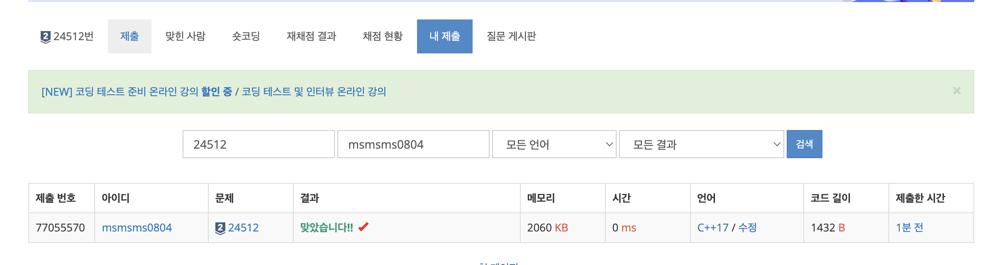

---

## 🔖 문제 설명

- tsp에서 정점비용의 최댓값중 최솟값을 구하고 그 경로를 같이 구하는 문제이다. 
- `link` : [`click`](https://www.acmicpc.net/problem/24512)

---

## 🍳 스스로 생각한 접근 방식

처음에는 TSP이므로 본증적으로 DP으로 풀려고 하였다. 하지만 N이 10이하이며 순회의 최솟값을 구하는 것이 아닌 가능한 순회경로중에서 정점비용의 최댓값중 최솟값을 구하는 문제였으므로 DP는 불필요했다.

 전체탐색을 사용하였다.

---

## ❗ 틀린 이유 설명

안틀림.

---

## ✅ 올바른 접근 방식 및 해결 방식

비트마스크를 사용하여 방문한 정점을 표시하였다. 그리고 각 정점에서 다음 정점으로 이동할 때, 정점비용의 최댓값을 구하였다. 모든 정점을 순회했을때를 재귀의 basecase로 설정하여, 정점비용의 최댓값중 최솟값을 구하였다.

---

## 🛠 자신의 풀이에서 개선할 부분

없는것 같다. 
