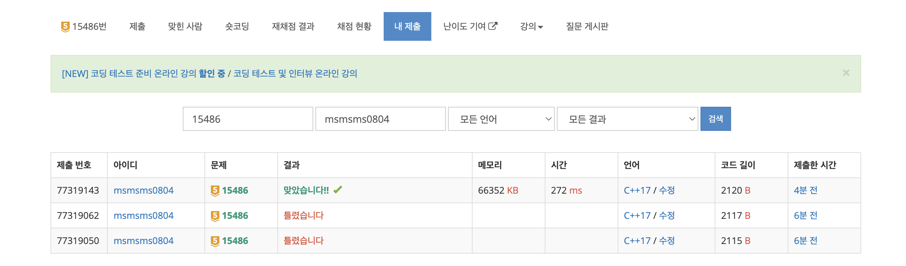

---

## 🔖 문제 설명

- 퇴사문제에서 시간복잡도를 고려하여 풀면 되는 문제이다. 
- `link` : [`click`](https://www.acmicpc.net/problem/15486)

---

## 🍳 스스로 생각한 접근 방식

recursive 함수를 사용하여 값을 구하였으며 DP는 해당 번째부터 시작할경우 얻을수있는 가장 큰 보상을 저장하게 하였고, 0부터 재귀를 돌려 해결하였다.

---

## ❗ 틀린 이유 설명

처음부터 맞게 풀었으나, 입력값이 1500000개가 아닌 1000개인줄알고 DP 배열 크기를 작게 설정하여 틀렸었다.
---

## ✅ 올바른 접근 방식 및 해결 방식

DP을 사용하여 BottomUp방식으로 해결하였다. 

---

## 🛠 자신의 풀이에서 개선할 부분

없는것 같다. 
