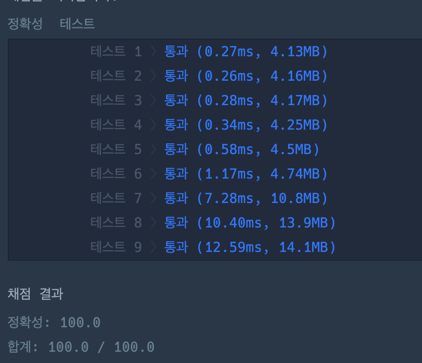

---

## 🔖 문제 설명

- n개의 노드가 있는 그래프가 있습니다. 각 노드는 1부터 n까지 번호가 적혀 있습니다. 1번 노드에서 가장 멀리 떨어진 노드의 갯수를 구하려고 합니다. 가장 멀리 떨어진 노드란, 1번 노드와 가장 멀리 떨어진 노드 사이의 간선의 개수를 의미합니다.
- `link` : [`click`](https://school.programmers.co.kr/learn/courses/30/lessons/49189)

---

## 🍳 스스로 생각한 접근 방식

1번 노드에서 가장 먼 노드들의 개수를 세는 문제였다. BFS는 깊이를 1씩 증가하면서 탐색하기 때문에, 가장 먼 노드들의 개수를 세는 것은 BFS를 이용하면 쉽게 해결할 수 있다.

+ 간선 입력이 edge로 주어져있는데, 해당 간선은 사용시 랜덤 access가 힘들것같아 따로 수정하였다.

---

## ❗ 틀린 이유 설명

안틀림.

---

## ✅ 올바른 접근 방식 및 해결 방식

위와 동일

---

## 🛠 자신의 풀이에서 개선할 부분

없는것 같다. 
