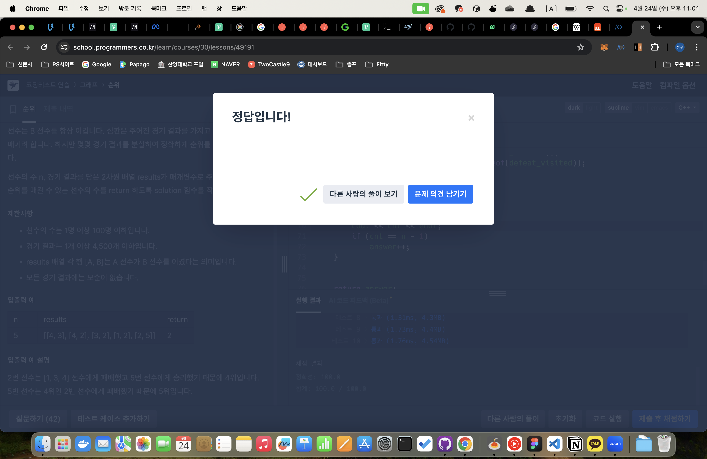

---

## 🔖 문제 설명

n명의 권투선수가 권투 대회에 참여했고 각각 1번부터 n번까지 번호를 받았습니다. 권투 경기는 1대1 방식으로 진행이 되고, 만약 A 선수가 B 선수보다 실력이 좋다면 A 선수는 B 선수를 항상 이깁니다. 심판은 주어진 경기 결과를 가지고 선수들의 순위를 매기려 합니다. 하지만 몇몇 경기 결과를 분실하여 정확하게 순위를 매길 수 없습니다.

선수의 수 n, 경기 결과를 담은 2차원 배열 results가 매개변수로 주어질 때 정확하게 순위를 매길 수 있는 선수의 수를 return 하도록 solution 함수를 작성해주세요

- `link` : [`click`](https://school.programmers.co.kr/learn/courses/30/lessons/49191)

---

## 🍳 스스로 생각한 접근 방식

DFS을 사용하여 해결하였다. 내가 이길수있는 또 질수있는 사람의 수가 n-1이면 순위를 매길수 있다.
따라서 재귀를 통해 이길수있는 사람과 질수있는 사람을 구하고 이를 통해 순위를 매길수 있는지 확인하였다.
---

## ❗ 틀린 이유 설명

안틀림.

---

## ✅ 올바른 접근 방식 및 해결 방식

위와 동일

---

## 🛠 자신의 풀이에서 개선할 부분

없는것 같다. 
